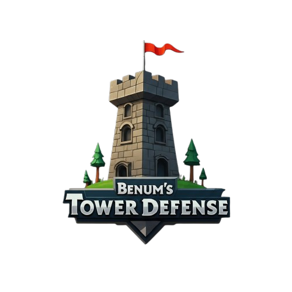
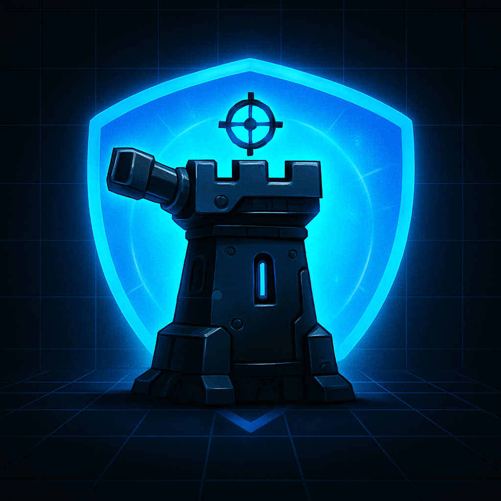

<!-- PROJECT LOGO -->
 

  

  <h3 align="center">The Rise of Benum</h3>

  

    Play now to join the new era of Tower Defense - with Mr. Benum ofc
     
     
    <a href="https://github.com/RichardP111/towerDef/issues/new?labels=bug&template=bug-report---.md">Report Bug</a>
    &middot;
    <a href="https://github.com/RichardP111/towerDef/issues/new?labels=enhancement&template=feature-request---.md">Request Feature</a>
  

## About The Project

The Rise of Benum is a new type of Tower Defense Game, with built in Mr. Benum's at its core. 

Features:
*  Place Mr. Benum towers
*  Fight off balloons do they don't reach the end 
*  Last as long as you can, with each wave being harder

### Built With

We used the following tools when building the program:

* [![Java][Java]][Java-url]

[Java]: https://img.shields.io/badge/Java-%23ED8B00.svg?logo=openjdk&logoColor=white
[Java-url]: https://www.java.com/en/
